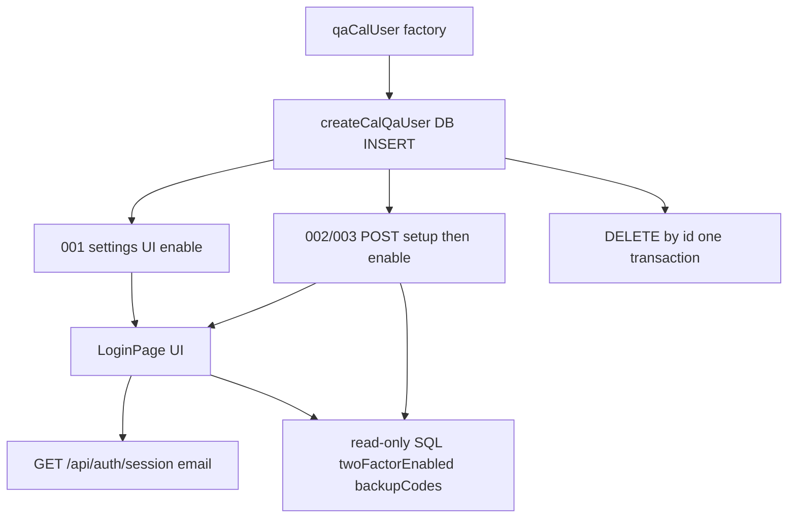

# Phase 2b Cal 2FA login

Plan ready after approval at [docs/plans/2026-10-09-phase-2b-cal-2fa.md](docs/plans/2026-10-09-phase-2b-cal-2fa.md) (Plan mode cannot write that path; first commit after approval is `docs(plan): phase 2b cal 2fa`).

**Decided in this session (AskQuestion):** 002 = strict RFC replay assertion + `test.fail`; no persisted `pro-2fa` storageState; keep traces and record that in ADR 0007; 001 enables 2FA in the settings UI, 002/003 enrol via setup/enable APIs.

## 1 Header

- Repo: `D:\Jayami\Portfolio\p1-web-e2e-ci` · [Jayami123/playwright-e2e-ci-framework](https://github.com/Jayami123/playwright-e2e-ci-framework) · P1
- Branch (after approval): `feat/2026-10-09-p1-phase2b-cal-2fa` from freshly pulled `origin/main`. Do not commit on `main`.
- Local `main` at planning: `d18a66467731b52b3e8c42246dfe4a8f6cf309a7` (**verified**). The prompt's expected `049b2a9` is stale; implementation pulls `origin/main` and uses that SHA.
- Working tree also has uncommitted [`.github/dependabot.yml`](.github/dependabot.yml). Leave it out of this branch.
- Harness: `qa-portfolio-harness#v0.2.2` ([package.json](package.json) line 25)
- Cal fork: `D:\Jayami\Portfolio\products\cal` · `Jayami123/cal` · `origin/main` `c2b7ac44c66f24ffef1662b276f0653988a609a3`. P1 CI `CAL_REF: main` ([e2e.yml](.github/workflows/e2e.yml) line 39). UI showed `v.6.2.0-sh`.
- `login-view.tsx` matches `origin/main` (success uses `router.push(callbackUrl)` at line 165, not `window.location.href`). Local dirty files are Prisma `.env` / untracked scripts, not login navigation.
- Phase: 2b. Date: 2026-10-09. Next ADR: 0007.

## 2 Goal and scope

Auth as a cross-domain primitive: TOTP window (RFC 6238), replay of a used code, single-use backup codes, and a session that exists only after the second factor. Upstream `apps/web/playwright/login.2fa.e2e.ts` covers enable / login / disable and decrypts the DB secret. P1 adds an independent session oracle, in-window replay, and single-use backup codes, without decrypting `users.twoFactorSecret`.

**In scope:** P1-CAL-2FA-001, 002, 003 only.

**Out of scope:** brute force / lockout (P5; `rateLimiter` no-ops when `UNKEY_ROOT_KEY` is unset, [rateLimit.ts](D:\Jayami\Portfolio\products\cal\packages\lib\rateLimit.ts) lines 33-41); wrong-code extra negatives; disable-requires-code; Documenso/Twenty 2FA; Dependabot majors; ADR 0005 `cal_ref` docs; merges/tags; cleaning leaked `qa-*` event types on `pro` (seen live on `/event-types`; findings log, not this PR).

## 3 Test-case mapping

All specs in new file [tests/cal/auth/2fa.spec.ts](tests/cal/auth/2fa.spec.ts). Describe uses `test.use({ storageState: { cookies: [], origins: [] } })` like FW-002 ([fw-storage-state.spec.ts](tests/cal/journeys/fw-storage-state.spec.ts) line 61). Tags `@cal @auth @2fa`.

- **P1-CAL-2FA-001** title `P1-CAL-2FA-001 TOTP login with an otplib-generated code`. Priority P1. Oracle: `GET /api/auth/session` user.email equals the Faker email (`sessionHasUser` plus email match). After that, `EventTypesPage` heading is visible. Do not treat landing URL alone as success (`router.push` uses `WEBAPP_URL`, which `.env.example` sets to `localhost`; P1 `baseURL` is `127.0.0.1`).
- **P1-CAL-2FA-002** title `P1-CAL-2FA-002 Same TOTP code replayed in a second context`. Priority P2. Oracle: RFC 6238 §5.2 (reject reuse). Assert context B has no session user and the failure signal is `incorrect-two-factor-code` (not `csrf=true`). After live confirmation that Cal accepts the replay, keep the strict assert and add scoped `test.fail` + `P7-OBS-CAL-2FA-002`.
- **P1-CAL-2FA-003** title `P1-CAL-2FA-003 Backup code works once`. Priority P1. Oracle: first backup login creates a session with matching email; read-only SQL `backupCodes` ciphertext changed; after Sign out, reuse shows `incorrect-backup-code` and no session.

## 4 Architecture



**Add**

- [src/core/totp.ts](src/core/totp.ts): product-agnostic step maths. Named constants `TOTP_STEP_MS = 30_000`, window `[1, 0]` matching [totp.ts](D:\Jayami\Portfolio\products\cal\packages\lib\totp.ts) lines 15-29. Injected `epochMs`. `totpCodeValidForMs`, `assertTotpBudget`, `generateTotpCode(secret, epochMs)` via `otplib` `authenticator`.
- [tests/unit/totp.spec.ts](tests/unit/totp.spec.ts): fixed epochs (start of step, 1 ms before boundary). No browser.
- [src/products/cal/pages/login.page.ts](src/products/cal/pages/login.page.ts): email/password Continue, TOTP fill + Submit, Lost access, backup fill + Submit, error alert.
- [src/products/cal/pages/two-factor-settings.page.ts](src/products/cal/pages/two-factor-settings.page.ts): `/settings/security/two-factor-auth`, switch, enable modal (password, secret, continue, enable, backup close).
- [src/products/cal/qa-user.ts](src/products/cal/qa-user.ts) (or helpers in `db.ts`): `createCalQaUser`, `teardownCalQaUserById`, `countCalQaUsers`, `sweepCalQaUsers`, `readTwoFactorState`.
- Fixture `twoFactorUser` on [fixtures.ts](src/products/cal/fixtures.ts): create user, enrol (UI or API per test option), return `{ id, email, username, name, secret, backupCodes }` (password stays in memory, never logged). Teardown always deletes by id.

**Change**

- [auth.ts](src/products/cal/auth.ts): optional `totpCode` / `backupCode` on `postCalCredentials`; `sessionHasEmail(payload, email)`; keep isolated `request.newContext` for any API login ([auth.ts](src/products/cal/auth.ts) lines 216-234).
- [routes.ts](src/products/cal/routes.ts): `twoFactorSettings`, `totpSetup`, `totpEnable`, `logout`.
- [factories.ts](src/products/cal/factories.ts): `qaCalUser()` → unique `qa-<run>-<worker>-…@qa.local`, username, name, in-memory password.
- [testIds.ts](src/products/cal/testIds.ts): `twoFactorSwitch`, `twoFactorSecret`, `gotoOtpScreen`, `enable2fa`, `backupCodesClose`, `loginForm`, `loginSubtitle`.
- [known-bug-evidence.ts](src/core/known-bug-evidence.ts): extend `SECRET_KEY` with `totp|backup|otp`.
- [package.json](package.json): `otplib` **12.0.1** exact (Cal [apps/web/package.json](D:\Jayami\Portfolio\products\cal\apps\web\package.json) line 119; v12 `authenticator.generate` matches the doc). `bcryptjs` as devDependency; pin from Cal `yarn.lock` at implement (hash cost 12, [hashPassword.ts](D:\Jayami\Portfolio\products\cal\packages\lib\auth\hashPassword.ts) lines 3-5).

**Reuse:** `loginCalWithCredentials` isolated CSRF pattern; `withWritableCalPool`; `attachKnownBugEvidence`; `installTimezoneHandler` (timezone dialog appeared on settings and event-types during the probe); FW empty `storageState`; EventTypes heading locator.

## 5 Locator discovery

Probes: Cursor browser, Cal `http://127.0.0.1:3000`, user `pro@example.com`, 2026-10-09. Counts below are from that session.

**Login** `/auth/login` (empty session)

- Email: `getByRole("textbox", { name: "Email" })` — count 1 (**verified**)
- Password: `getByRole("textbox", { name: "Password" })` — count 1 (**verified**)
- Continue: `getByRole("button", { name: "Continue" })` — count 1 (**verified**)
- Form: `getByTestId("login-form")` from [login-view.tsx](D:\Jayami\Portfolio\products\cal\apps\web\modules\auth\login-view.tsx) line 244

**Login 2FA step** (source only; needs a 2FA user, not probed live)

- Subtitle becomes `t("2fa_code")` = "Two-factor code" ([login-view.tsx](D:\Jayami\Portfolio\products\cal\apps\web\modules\auth\login-view.tsx) line 191)
- Submit: `getByRole("button", { name: "Submit" })` (`t("submit")` line 317)
- Six inputs `name="2fa1"…"2fa6"`, sibling `Label` with no `htmlFor` ([TwoFactor.tsx](D:\Jayami\Portfolio\products\cal\apps\web\components\auth\TwoFactor.tsx) lines 29-45). P7 a11y: WCAG 4.1.2
- Plan: wait for Submit, then `keyboard.type` the 6 digits onto the autoFocused first box (index 0 `autoFocus`). First implementation spike must log `document.activeElement` and the textbox count. Do not copy upstream `fillOtp` regenerate-on-expiry. If autoFocus fails, exception with reason + `eslint-disable playwright/no-raw-locators` for `input[name="2fa1"]` only, recorded in ADR 0007
- Error: `Alert` title `${t("incorrect_2fa_code")} ${t("please_try_again")}` ([login-view.tsx](D:\Jayami\Portfolio\products\cal\apps\web\modules\auth\login-view.tsx) line 135) plus callback `error=incorrect-two-factor-code`. Never "any failure", never `csrf=true`

**Backup**

- `getByRole("button", { name: "Lost access" })` (`t("lost_access")`, [common.json](D:\Jayami\Portfolio\products\cal\packages\i18n\locales\en\common.json) line 2945)
- Field: `id="backup-code"`, `label=""`, placeholder `XXXXX-XXXXX` ([BackupCode.tsx](D:\Jayami\Portfolio\products\cal\apps\web\components\auth\BackupCode.tsx) lines 13-26). After Lost access, expect one textbox: `getByRole("textbox")` in the login form. Do not use `getByPlaceholder`
- Error: `t("incorrect_backup_code")` = "Backup code is incorrect." (line 2944)

**Settings 2FA** `/settings/security/two-factor-auth` as pro, 2FA off (**verified**)

- Heading: `getByRole("heading", { name: "Two-factor authentication" })` — count 1
- Switch: `role="switch"`, **no accessible name**, `data-testid="two-factor-switch"`, `aria-checked="false"`, count 1. Use `getByTestId("two-factor-switch")`. P7 a11y note
- Enable dialog heading: "Enable two-factor authentication". Password input `id="password"` but label `for` is a generated id (`_r_g_`), accessible name was the bullet placeholder. Locator: dialog `getByRole("textbox")` (count 1 in the dialog). Cancel / Continue by role name. Continue starts disabled until password is filled
- Secret: `getByTestId("two-factor-secret")` — 32 chars ([EnableTwoFactorModal.tsx](D:\Jayami\Portfolio\products\cal\apps\web\components\settings\EnableTwoFactorModal.tsx) lines 198-199)
- `getByTestId("goto-otp-screen")`, `enable-2fa`, `backup-codes-close`. Enable modal **auto-submits** when `totpCode` length is 6 (lines 160-165). Login form does **not** auto-submit
- Do not toggle 2FA on `pro`. Probe opened the modal and Cancelled

**Logout** (**verified** on `/event-types`)

- User menu: `getByRole("button", { name: <user.name> })` (pro showed "Pro Example")
- `getByRole("menuitem", { name: "Sign out" })` — count 1

**Host trap** (**verified**): Continue on `http://127.0.0.1:3000/auth/login` bounced the tab to `http://localhost:3000/auth/login`. Session still worked on `127.0.0.1/event-types`. Tests must poll session on Playwright's `127.0.0.1` origin, then `page.goto(CAL_ROUTES.eventTypes)`, not trust `router.push(WEBAPP_URL)`.

## 6 Oracle design

- **Session:** `GET /api/auth/session` ([routes.ts](src/products/cal/routes.ts) line 4). Success: `sessionHasEmail` true. Failure: false, and `error` is the specific `ErrorCode` ([ErrorCode.ts](D:\Jayami\Portfolio\products\cal\packages\features\auth\lib\ErrorCode.ts) lines 9-11), not CSRF.
- **DB (read-only, by user id):** `twoFactorEnabled = true` after enable; after first backup use, `backupCodes` ciphertext `!==` pre-use value (compare in memory; do not log ciphertext). [authorizeCredentials](D:\Jayami\Portfolio\products\cal\packages\features\auth\lib\next-auth-options.ts) lines 197-211 nulls the matched slot and re-encrypts.
- **TOTP:** `otplib.authenticator.generate(secret)` from setup JSON or `two-factor-secret` text. Never decrypt DB.
- **002:** RFC 6238 §5.2 says reject replay. Cal has no used-code store and window `[1, 0]` (**verified** source). Live confirm during implementation; then strict assert + `test.fail`.
- **003:** first use succeeds; second `incorrect-backup-code`. Backup match strips dashes (line 200).

No oracle reads the UI under test except as a secondary check after the session/DB/RFC signal.

## 7 Test data, isolation and cleanup

Never toggle 2FA on `pro` / `trial`.

**Create (chosen path: SQL INSERT, not signup)**

- Signup [route.ts](D:\Jayami\Portfolio\products\cal\apps\web\app\api\auth\signup\route.ts) lines 31-35 can 403 when `NEXT_PUBLIC_DISABLE_SIGNUP` or flag `disable-signup`. Self-hosted create then `sendEmailVerification` ([selfHostedHandler.ts](D:\Jayami\Portfolio\products\cal\apps\web\app\api\auth\signup\handlers\selfHostedHandler.ts) lines 163-191) and does not set `completedOnboarding`. Empty-body signup HTTP status was **not verified** live this session.
- Match seed [seed-utils.ts](D:\Jayami\Portfolio\products\cal\scripts\seed-utils.ts) lines 41-80: `emailVerified = now()`, `completedOnboarding = true` (default false at schema line 430 would send login to getting-started, not `/event-types`), `locale = 'en'`, `identityProvider` default `CAL`, unique `email` + `username`, `UserPassword.hash` bcrypt cost 12. Optional first spike: user+password only; if settings/login need a schedule, add `Working Hours` + `Availability` like seed (weekdays 09:00-17:00 per ADR 0006).
- Columns login/settings use: `email`, `username`, `name`, `completedOnboarding`, `emailVerified`, `password` (UserPassword), `twoFactorEnabled`, `twoFactorSecret`, `backupCodes`, `locked` (must stay false). `Profile` requires `organizationId` (schema 540-541); personal users do not need a Profile row.
- Password generated in memory. Never `console.log`, step titles, annotations, attachments, or commits.

**TOTP budget (no sleeps, no regenerate loop)**

- Window `[1, 0]` ⇒ a code minted in step T remains valid through the end of step T+1, so at least 30 s.
- `assertTotpBudget({ epochMs, neededMs: 25_000 })` throws if remaining validity &lt; 25 s (step-edge). CI retries 2; local retries 0.
- 002: both contexts wait on the 2FA Submit button, **then** generate once, fill A, submit A, fill B, submit B, all inside the budget.
- `page.clock` cannot move Cal's server TOTP clock.

**Teardown (by id, one transaction, even on failure)**

`Availability.scheduleId` has **no** `onDelete` ([schema.prisma](D:\Jayami\Portfolio\products\cal\packages\prisma\schema.prisma) lines 960-971) so delete Availability before Schedule. Then:

```sql
BEGIN;
DELETE FROM "Availability" WHERE "userId" = $1
  OR "scheduleId" IN (SELECT id FROM "Schedule" WHERE "userId" = $1);
DELETE FROM "Schedule" WHERE "userId" = $1;
DELETE FROM "Session" WHERE "userId" = $1;
DELETE FROM users WHERE id = $1 RETURNING id;
COMMIT;
```

`UserPassword`, `Session`, most children are `onDelete: Cascade` from User. Restrict edges (`EventTypeTranslation.creator`, `BookingInternalNote.createdBy`) should not exist for these users; if DELETE fails, throw with `cause`. `rowCount !== 1` on `users` throws. Aggregate teardown errors.

**Sweep / leftover proof**

```sql
SELECT count(*)::int AS leftover
FROM users
WHERE email LIKE 'qa-%@qa.local';
```

Must be 0 after each gate run. Sweep leftovers before the local gate. Throw if sweep matches 0 when a known id was expected; sweep of unknowns is pre-run only.

## 8 Known-bug handling

**P1-CAL-2FA-002** (decided): `P7-OBS-CAL-2FA-002`. After both logins and redacted evidence (`sessionUserOnB`, `callbackError`; never the TOTP value), `test.fail(true, issue)` then assert B has no session and `incorrect-two-factor-code`. If live replay is **rejected**, drop `test.fail` and say so in Deviations. Entry in [docs/observations/](docs/observations/) plus findings log.

001 and 003: none known. Label failures PRODUCT vs TEST before changing asserts.

## 9 CI and workflow changes

**No CI change.** `CALENDSO_ENCRYPTION_KEY` is already generated and masked per run ([e2e.yml](.github/workflows/e2e.yml) lines 251-258). Report uploads already use `if: ${{ !cancelled() }}` (lines 343-357). No new env, no renamed required checks (`e2e / lint`, `e2e / typecheck (always)`, `e2e / cal-self-hosted`). P1 does not read the encryption key; secrets come from setup JSON / on-screen secret.

## 10 Risks and unknowns

- OTP six boxes have no accessible name — spike before specs; fallback documented above
- Live TOTP replay not confirmed — confirm before committing `test.fail`
- `WEBAPP_URL` localhost vs P1 `127.0.0.1` — session oracle + explicit `goto` (probed)
- Signup vs INSERT — INSERT chosen; signup 403 **not verified** live
- `qa-%@qa.local` leftover count **not verified** this session (event-type leaks on `pro` were visible; out of scope)
- User+password without schedule — spike; add Working Hours if settings/login break
- `bcryptjs` version — read Cal `yarn.lock` at implement, do not guess
- Timezone dialog on settings — `installTimezoneHandler` already auto on fixtures ([fixtures.ts](src/products/cal/fixtures.ts) lines 82-88)
- CSRF — isolated context only
- Enable modal auto-submit vs login Submit — do not click Enable after 6 digits on settings; do click Submit on login

## 11 Verification plan

Hard gate before push (local, Cal at `http://127.0.0.1:3000`):

1. `npm run lint`
2. `npm run format:check`
3. `npm run typecheck`
4. `npm run test:unit` (existing plus totp helper)
5. `npm run test:cal` twice, paste real summary lines
6. After each E2E run, leftover SQL count = 0

**Expected `test:cal` summary** (source count **verified**, not a fresh local run this session): today `cal-setup` 2 + `cal-chromium` 15 = 17 (TZ-001 ×3, TZ-002, TZ-003 ×2, TZ-004, DST ×4, FW ×4). After 2b: **20 passed**, **4 expected failures** (DST-002, DST-003, TZ-003 Kathmandu, 2FA-002), **0 flaky**. Playwright counts expected-fail as passed when they fail as expected.

CI after push: paste `cal-self-hosted` job summary totals. No invented numbers.

## 12 Commit plan

1. `docs(plan): phase 2b cal 2fa` (this file)
2. `build(deps): add otplib 12.0.1 and bcryptjs for 2FA tests`
3. `feat(core): add totp step budget helper and unit tests`
4. `feat(cal): add qa user DB helpers and 2FA fixtures`
5. `feat(cal): add login and 2FA settings page objects`
6. `test(cal): add P1-CAL-2FA-001 to 003`
7. `docs(adr): record 2FA test design in 0007` (README 11 → 14 of 66 only after the real run)

Each commit leaves lint and typecheck green.

## 13 Docs and ADR

- README coverage **11 → 14 of 66** with the real `test:cal` line after the gate. Implemented-cases table adds the three IDs. Folder structure: `tests/cal/auth/`.
- ADR 0007: Faker users not pro; skip storageState persist; 001 UI enable vs 002/003 API; TOTP budget; traces kept because the user is deleted (secret is dead); OTP a11y exception if any; replay `test.fail`; never decrypt `CALENDSO_ENCRYPTION_KEY`.
- [docs/observations/](docs/observations/): `P7-OBS-CAL-2FA-002` after live confirm.

## 14 Will NOT do

Brute force/lockout (P5); extra negatives; Documenso/Twenty 2FA; Dependabot majors / this repo's dirty `dependabot.yml`; ADR 0005 `cal_ref` docs; cleaning leaked `qa-*` event types on `pro`; decrypting DB 2FA columns; `page.clock` for TOTP; sleeps/retries to hide step edges; merges, tags, force-push; changing seed users.

## 15 Open questions for Jayami

The four plan conflicts are **decided** (see header). None blocking.

Implementation-time only (not product choices): live OTP fill path, live replay confirm, leftover `qa-%@qa.local` count, `bcryptjs` pin from Cal lockfile.

Plan ready at `docs/plans/2026-10-09-phase-2b-cal-2fa.md`. Waiting for approval.

## Deviations (implementation 2026-10-09)

- **P1-CAL-2FA-002 replay:** Live run on `http://127.0.0.1:3000` **verified** Cal accepts the same TOTP in a second context within the window; `test.fail` + `P7-OBS-CAL-2FA-002` kept (not dropped).
- **QA user INSERT:** Added required `uuid` via `gen_random_uuid()` (Prisma schema).
- **Sign-out flow:** Logout lands on `/auth/logout`; tests use `LoginPage.signOut` → `goto` login (not only `router.push`).
- **`generateTotpCode`:** otplib v12 `generate(secret)` uses wall clock; `epochMs` drives `assertTotpBudget` at call sites.
