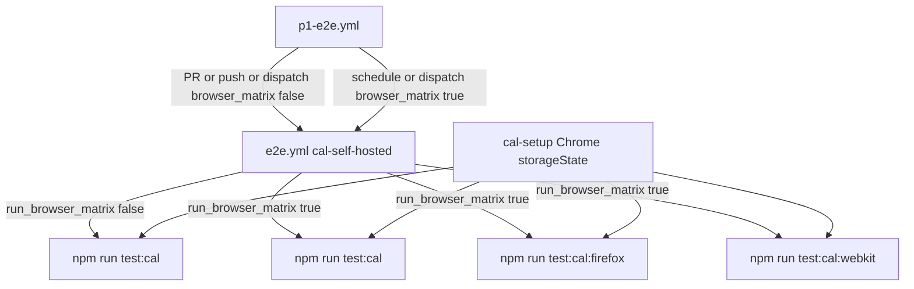

# Phase 2c Cal browser matrix

Plan file after approval: [docs/plans/2026-10-09-phase-2c-cal-browser-matrix.md](docs/plans/2026-10-09-phase-2c-cal-browser-matrix.md) (Plan mode cannot write that path; first commit is `docs(plan): phase 2c cal browser matrix`).

## 1 Header

- Repo: `D:\Jayami\Portfolio\p1-web-e2e-ci` · [Jayami123/playwright-e2e-ci-framework](https://github.com/Jayami123/playwright-e2e-ci-framework) · P1
- Branch (after approval): `feat/2026-10-09-p1-phase2c-cal-browser-matrix` from freshly pulled `origin/main`. Do not commit on `main`. Push the branch; do not open a PR.
- Base SHA **verified** this session: `e354d56960f7872a25497e30e4745e12afff0839` (`Merge pull request #13: chore(cal): post-2b cleanup`). Local `main` matches `origin/main`. PR #13 cleanup (TOTP budget helpers removed) is present.
- Working tree: clean on `main`.
- Harness: `qa-portfolio-harness#v0.2.2` ([package.json](package.json) line 25)
- Cal fork: `D:\Jayami\Portfolio\products\cal` · `Jayami123/cal` · `origin/main` `c2b7ac44c66f24ffef1662b276f0653988a609a3`. P1 CI `CAL_REF: main` ([e2e.yml](.github/workflows/e2e.yml) line 39). Local dirty files are Prisma `.env` / untracked scripts; not used.
- Playwright: 1.63.0. Chromium installed (`chromium-1243`). Firefox 155 / WebKit 26.6 **not** on disk (`firefox-1543` / `webkit-2359` missing). Cal at `http://127.0.0.1:3000` CSRF/login/booker HTTP 200 **verified**.
- Phase: 2c. Date: 2026-10-09. Next ADR: 0008.

## 2 Goal and scope

Same user-visible primitives across engines: booker slot labels (`timezoneId` plus `Intl` in V8 / SpiderMonkey / JavaScriptCore) and TOTP second-factor login. Upstream `@calcom/web` is Chromium-only (P1 doc CAL09 / CAL27). Engineering signal: PR gate stays Chromium; full matrix is nightly (doc §6).

**In scope:** run existing P1-CAL-TZ-001..004 and P1-CAL-2FA-001..003 in `cal-firefox` and `cal-webkit`. Schedule and `workflow_dispatch` on the **existing** [p1-e2e.yml](.github/workflows/p1-e2e.yml) (no new workflow file). Flaky policy: `failOnFlakyTests: Boolean(process.env.CI)` on PR and nightly. Per-browser artifacts and job-summary rows. ADR 0008. Push the feature branch; do not open a PR in this task.

**Out of scope (reasons):**

- I18N-001..003 and VIS-001..004: Phase 3 (visual baselines, German/RTL, axe).
- FW-001..004 in Firefox/WebKit: framework plumbing, not engine-sensitive.
- DST-001..003 and DST-003-control in Firefox/WebKit: the doc gives DST no browser dimension; they provision Sunday schedules on trial and would triple that cost.
- New case IDs, Slack alert, sharding the self-hosted job, other products.

## 3 Test-case mapping

Tags already on specs: `@tz` in [tz.spec.ts](tests/cal/tz-i18n/tz.spec.ts), `@2fa` in [2fa.spec.ts](tests/cal/auth/2fa.spec.ts). New projects use project-level `grep: /@tz|@2fa/` and `testDir: ./tests/cal` so unit `@tz` helpers are not selected.

**`--list` this session (`CAL_E2E=0`, Chromium only today):**

- `npx playwright test --list --project=cal-chromium`: **20 tests in 7 files** (2 `cal-setup` + 18 E2E).
- `npx playwright test --list --project=cal-chromium --grep "@tz|@2fa"`: **12 tests in 3 files** = 2 setup + **10 matrix cases**. Matches 7 TZ + 3 2FA.

After config, `--list` per new project (setup still listed as a dependency):

- `cal-setup`: 2
- `cal-firefox`: 10 (7 `@tz` + 3 `@2fa`)
- `cal-webkit`: 10
- Expected failures per new browser: 2 (TZ-003 Kathmandu, 2FA-002), **if both reproduce**. If one engine passes a `test.fail` case, stop; do not add `browserName` conditions.

IDs × browsers (oracle unchanged; cleanup in §7):

- **TZ-001** Auckland / Colombo / Los_Angeles × chromium, firefox, webkit. Oracle: `expectSlotLabelsMatch` vs `expectedSlotLabelsForViewerDay` / `toZonedLabel` ([timezone.ts](src/core/timezone.ts) 248–256, 286–291). Guest empty `storageState`.
- **TZ-002** Colombo × 3 browsers. Oracle: clicked `data-time` + `readBookingOracle` (success When line + SQL `Booking.startTime`). Cleanup: `bookingCleanup` by uid + `eventTypeCleanup` by title.
- **TZ-003** Kathmandu (`test.fail` P7-OBS-CAL-TZ-003) and Adelaide × 3 browsers.
- **TZ-004** Colombo then switcher to `America/New_York` × 3 browsers. Oracle: first label vs `toZonedLabel(..., NEW_YORK_TZ)`; switcher text persist.
- **2FA-001** session email then explicit `/event-types`.
- **2FA-002** `test.fail` P7-OBS-CAL-2FA-002; RFC replay; `incorrect-two-factor-code`.
- **2FA-003** first backup session; ciphertext change; reuse `incorrect-backup-code`.
- TOTP: `generateTotpCode(secret, Date.now())` at each mint site ([totp.ts](src/core/totp.ts) 19–21). Never future-step codes.

Chromium PR suite stays all 18 E2E + 2 setup (FW + DST included).

## 4 Architecture



**Add**

- [playwright.config.ts](playwright.config.ts) projects `cal-firefox` (`devices["Desktop Firefox"]`) and `cal-webkit` (`devices["Desktop Safari"]`). Both `dependencies: ["cal-setup"]`, `testDir: ./tests/cal`, `grep: /@tz|@2fa/`, same `storageState` as chromium when live. Reason: storageState is cookies/origins, browser-agnostic; one Chrome setup avoids triple seed login.
- [package.json](package.json) scripts: `test:cal` unchanged; `test:cal:firefox` = `--project=cal-firefox`; `test:cal:webkit` = `--project=cal-webkit`; `test:cal:matrix` = both new projects (local gate, one command as required).
- [docs/adr/0008-cal-browser-matrix.md](docs/adr/0008-cal-browser-matrix.md)

**Change**

- [playwright.config.ts](playwright.config.ts): `failOnFlakyTests: Boolean(process.env.CI)` on **PR and nightly** (Playwright ≥1.52; we are 1.63.0). Decided. When `P1_PW_REPORT_ID` is set, JSON/JUnit/blob paths become `test-results/results-${id}.json`, `test-results/junit-${id}.xml`, `blob-report-${id}`. Unset keeps today’s paths so PR/push artifact names stay the same.
- [p1-e2e.yml](.github/workflows/p1-e2e.yml): add `schedule: cron 0 18 * * *` and a boolean `workflow_dispatch` input `browser_matrix` default `false`. Pass `run_browser_matrix: ${{ github.event_name == 'schedule' || (github.event_name == 'workflow_dispatch' && inputs.browser_matrix) }}` into `e2e.yml`. PR and `push` to `main` still omit the matrix (expression is false). Reason: GitHub only lists `workflow_dispatch` for workflows that already exist on `main`; a new `p1-e2e-nightly.yml` on this branch could not be dispatched. Do **not** add that file.
- Concurrency on [p1-e2e.yml](.github/workflows/p1-e2e.yml): change the group to `${{ github.workflow }}-${{ github.event_name }}-${{ github.ref }}`, keep `cancel-in-progress: ${{ github.event_name == 'pull_request' }}`. Reason: a `schedule` run on `main` must not share a group with `pull_request` (and must not cancel PRs). PR cancel-in-progress behaviour stays the same.
- [e2e.yml](.github/workflows/e2e.yml): boolean `workflow_call` input `run_browser_matrix` default `false`. No free-text input on `run:`, checkout `ref`, or cache keys. When the boolean is true, also pass `playwright_browsers_timeout_minutes: 20` from `p1-e2e.yml` (PR/push keep the default 10).
- [.github/actions/playwright-browsers/action.yml](.github/actions/playwright-browsers/action.yml): boolean `install_firefox_webkit` default `false`. Two steps with **fixed** commands (input only in `if:`): chromium-only vs `npx playwright install chromium firefox webkit --with-deps`. Cache key stays `${{ runner.os }}-ms-playwright-${{ version }}` (do not put the boolean in the key).
- [schedules.ts](src/products/cal/schedules.ts) lines 29–33: `BOOKING_WINDOW_OFFSET_BY_PROJECT` add `"cal-firefox": 7`, `"cal-webkit": 14`. Chromium stays 0. Reason: TZ-002 books once per browser against one Cal; unique week offsets avoid slot-hold collisions if teardown is late.
- [write-ci-job-summary.mts](scripts/write-ci-job-summary.mts) + [playwright-json-summary.ts](src/core/playwright-json-summary.ts): optional browser label and elapsed seconds; one heading/table per browser. Unit tests in [playwright-json-summary.spec.ts](tests/unit/playwright-json-summary.spec.ts).
- Leftover proof: extend [scripts/count-trial-qa.mts](scripts/count-trial-qa.mts) **only** (no sibling script). Keep `npx tsx scripts/count-trial-qa.mts`. Print one JSON that already has trial `schQaSchedules` / `qaEventTypes` / … and also `qaUsers` (`countCalQaUsers`) and `qaBookings` (accepted/pending rows whose attendee email is `qa-%@qa.local`). Add the booking count helper on [db.ts](src/products/cal/db.ts) if needed so the script stays a thin printer. Do not use `tsx -e` (that CJS path failed this session).
- README / ADR 0006 line 105 / CONTRIBUTING before-push line: document matrix script and nightly. Coverage stays **14 of 66**.

**Do not change** specs, POMs, or [totp.ts](src/core/totp.ts) unless the post-install Firefox/WebKit probe proves a locator/focus TEST BUG.

**Reuse:** `cal-setup` Chrome storageState; `guestBooker` already opens a context with `timezoneId` on the project’s browser ([fixtures.ts](src/products/cal/fixtures.ts) 258–264); 2FA `browser.newContext` uses the project browser; `attachKnownBugEvidence`; isolated CSRF login in [auth.ts](src/products/cal/auth.ts).

## 5 Locator and focus discovery per engine

**Chromium (Playwright MCP, 2026-10-09, `http://127.0.0.1:3000/pro/30min?month=2026-10`, Thu 15 selected) — verified**

- `getByRole("combobox", { name: "Timezone Select" })` count **1**, `data-testid="timezone-select"` count **1**. Opened list: **333** options including America/New York, Asia/Kathmandu, Australia/Adelaide, Pacific/Auckland.
- Slot buttons `data-testid="time"` count **14** on that day; labels `2:30pm`…`9:00pm`, no U+202F in slot text; `data-time` first `2026-10-15T09:00:00.000Z`. Existing POM locators stay.
- Intl in this Chromium: `en-US` `hour12` for `2026-10-15T03:30:00.000Z` → Colombo `9:00 AM`, Auckland `4:30 PM`, LA `8:30 PM`, NY `11:30 PM`, Kathmandu `9:15 AM`, Adelaide `2:00 PM`. Oracle already uses `normalizeSlotLabel` (strip U+202F, lowercase, strip spaces).
- `Need help?` href uses `http://localhost:3000/...` (**verified** WEBAPP_URL trap). Landing URL is never the oracle.

**Firefox and WebKit — not verified this session.** Launch failed: executables missing at `ms-playwright\firefox-1543` and `webkit-2359`. Cursor/Playwright MCP is Chromium-only.

**2FA six-box focus — not verified in Firefox/WebKit.** Source [TwoFactor.tsx](D:\Jayami\Portfolio\products\cal\apps\web\components\auth\TwoFactor.tsx) line 43 `autoFocus={autoFocus && index === 0}` on `name="2fa1"`. POM [login.page.ts](src/products/cal/pages/login.page.ts) 40–44 `keyboard.type` after Submit visible. Creating a 2FA user would be a write; skipped in plan mode.

**Implementation gate (before any spec/POM edit):** `npx playwright install firefox webkit`, then headed probes of (1) booker TZ combobox + slot `data-testid="time"` counts, (2) Intl sample + `normalizeSlotLabel` vs first slot, (3) 2FA step `document.activeElement` after Submit is visible (use existing 2FA-001 path, delete the QA user). Record counts in ADR 0008. If autofocus fails in one engine: click `input[name="2fa1"]` with the existing ADR 0007 raw-locator exception, **not** `if (browserName)`.

WebKit on Windows (`Playwright.exe`) vs Ubuntu CI WebKit: any CI-only failure is **not verified** locally; collect Linux evidence from the dispatch run.

## 6 Oracle design

Unchanged. No browser’s UI is an oracle for another.

- TZ labels: `Intl` in `src/core/timezone.ts`, compared after `normalizeSlotLabel`.
- TZ-002: `data-time` instant + Postgres `Booking.startTime` + success When line ([oracle.ts](src/products/cal/oracle.ts), [db.ts](src/products/cal/db.ts) 253–264).
- 2FA success: `sessionHasEmail` on `GET /api/auth/session`, then `page.goto(CAL_ROUTES.eventTypes)` ([adr 0007](docs/adr/0007-cal-2fa-testing.md) line 14).
- 2FA failure: `credentialsCallbackErrorParam` is `incorrect-two-factor-code` / `incorrect-backup-code`, never `csrf=true`.
- 2FA-003: `backupCodes` ciphertext inequality, ciphertext not logged.
- TOTP: `generateTotpCode(secret, Date.now())` at the mint site only.

## 7 Test data, isolation and cleanup

- 2FA: still Faker `qa-*@qa.local`, create/teardown by id, `sweepCalQaUsers` BEGIN-before-SELECT ([qa-user.ts](src/products/cal/qa-user.ts) 174–195). Three browsers in one nightly job are **sequential steps**, each with its own fixture teardown. No shared 2FA user.
- TZ-002: isolated event type on `pro` + guest booker + cancel by uid. Offsets 0 / 7 / 14 days on the 90-day base ([booker-tz.ts](src/products/cal/booker-tz.ts) 78–81). Slot hold remains Cal `SelectedSlots` ~5 min ([adr 0006](docs/adr/0006-cal-timezone-testing.md) line 67); sequential steps plus unique offsets keep busy-time selection correct. **Prove with two local `test:cal:matrix` runs.**
- Keep local trial sweep and `qa-%@qa.local` sweep in [global-setup/index.ts](global-setup/index.ts) 63–86 (CI skipped, as today).
- Leftover proof after each gate run (must all be 0):

```sql
-- trial sch-qa / qa event types (existing countTrialQaArtifacts)
-- users
SELECT count(*)::int FROM users WHERE email LIKE 'qa-%@qa.local';
-- QA bookings
SELECT count(*)::int FROM "Booking" b
JOIN "Attendee" a ON a."bookingId" = b.id
WHERE a.email LIKE 'qa-%@qa.local' AND b.status IN ('accepted', 'pending');
```

This session: `npx tsx scripts/count-trial-qa.mts` → trial counts all **0**. After the script extension, the same command must print `qaUsers` and `qaBookings` as well. Re-run that one command after each local gate.

IPv6: keep `127.0.0.1`, never `localhost`. CSRF: keep isolated `APIRequestContext` in `loginCalWithCredentials`.

## 8 Known-bug handling per browser

Existing `test.fail(true, issue)` stays **unconditional**, after setup, before the strict assert, with `issue` annotation and `attachKnownBugEvidence`.

- TZ-003 Kathmandu: [tz.spec.ts](tests/cal/tz-i18n/tz.spec.ts) 138; [cal-tz-dst-known-issues.md](docs/observations/cal-tz-dst-known-issues.md)
- 2FA-002: [2fa.spec.ts](tests/cal/auth/2fa.spec.ts) 120; [cal-2fa-known-issues.md](docs/observations/cal-2fa-known-issues.md)

If Firefox or WebKit does **not** reproduce: Playwright reports “expected to fail but passed”. Stop. Collect trace/screenshot. Label PRODUCT vs TEST. Raise as an open question. Never `test.fail(browserName === …)`.

DST known bugs stay Chromium-only (out of matrix).

## 9 CI and workflow changes

**PR and `push` to `main` stay Chromium-only** (`npm run test:cal`, [e2e.yml](.github/workflows/e2e.yml) 273–286). Artifact names `playwright-report` / `playwright-test-results` unchanged on that path. Required checks stay `e2e / lint`, `e2e / typecheck (always)`, `e2e / cal-self-hosted`.

**Caller [p1-e2e.yml](.github/workflows/p1-e2e.yml)** (today lines 1–19) is edited; no new workflow file:

```yaml
on:
  pull_request:
  push:
    branches: [main]
  schedule:
    - cron: "0 18 * * *"
  workflow_dispatch:
    inputs:
      browser_matrix:
        description: Run Firefox and WebKit as well as Chromium on self-hosted Cal
        type: boolean
        default: false

concurrency:
  group: ${{ github.workflow }}-${{ github.event_name }}-${{ github.ref }}
  cancel-in-progress: ${{ github.event_name == 'pull_request' }}

jobs:
  e2e:
    uses: ./.github/workflows/e2e.yml
    with:
      run_browser_matrix: ${{ github.event_name == 'schedule' || (github.event_name == 'workflow_dispatch' && inputs.browser_matrix) }}
      playwright_browsers_timeout_minutes: ${{ (github.event_name == 'schedule' || (github.event_name == 'workflow_dispatch' && inputs.browser_matrix)) && 20 || 10 }}
    secrets: inherit
```

`run_browser_matrix` is a boolean expression, not a string interpolated into `run:`. Dispatch on this workflow works from a feature branch because `p1-e2e.yml` already exists on `main`.

**Reusable [e2e.yml](.github/workflows/e2e.yml)**

- Input `run_browser_matrix: boolean`, default `false`.
- `cal-self-hosted` still one job, no shards (ADR 0005 line 35).
- Browser install: pass `install_firefox_webkit` only when the boolean is true (input in `if:` / `with:`, not interpolated into a `run:` string).
- When boolean is false: today’s single “Run Cal E2E suite” step.
- When true, four test-adjacent steps, each `if: ${{ !cancelled() }}` so one engine failure does not skip the others:
  1. Chromium: `npm run test:cal` with `P1_PW_REPORT_ID=chromium`
  2. Firefox: `npm run test:cal:firefox` with `P1_PW_REPORT_ID=firefox`
  3. WebKit: `npm run test:cal:webkit` with `P1_PW_REPORT_ID=webkit`
  4. After each: write job summary from that JSON (heading includes browser + `$SECONDS` wall-clock); merge that blob to `playwright-report-${id}`; upload `playwright-report-${id}` and `playwright-test-results-${id}` with `if: ${{ !cancelled() }}`.
- Cache saves remain `push` + `refs/heads/main` only (lines 237–238, 368–369).
- Live-URL 4-shard Chromium path unchanged (lines 109–140). Nightly on this repo has no live URL secret, so it uses self-hosted.

**Retries / flaky:** CI `retries: 2` ([playwright.config.ts](playwright.config.ts) line 35) stays. `failOnFlakyTests: true` in CI makes a retry-then-pass a red step, not a green check that hid “1 flaky”. Job summary still prints the flaky column; read that footer per browser, not the check colour.

**Timeout arithmetic (no invented nightly duration):**

- Job timeout stays **90** (`self_hosted_timeout_minutes` default, line 11). README warm Chromium job was 5m 23s on a **5-test** era run (37792386085); current 20-test wall-clock on GitHub was **not verified** this session (`gh` unused). Brief states ~2.2–2.9 min tests inside ~6 min job (**not verified** here).
- Extra work when matrix is on: install firefox+webkit + 10 tests × 2 engines + two extra `cal-setup` logins. Pathological upper bound uses prod test timeout 60s × 10 × 2 = 20 min tests plus 2FA `isolatedJourney` 300s ([env.ts](src/products/cal/env.ts) 32–34). 90 minutes still covers a cold `next build` plus that. Revisit only if a dispatch run nears 90.
- Matrix path (schedule or dispatch with `browser_matrix: true`) passes `playwright_browsers_timeout_minutes: 20`. PR/push keep 10.

**CodeQL:** boolean + fixed npm scripts only. No string `workflow_call` input on `run:`, `ref:`, or cache `key:`.

## 10 Risks and unknowns

- Firefox/WebKit not installed locally — install then probe before editing tests (when: first implementation hour).
- OTP autofocus in Gecko/WebKit — probe `activeElement`; fallback ADR 0007 raw `2fa1`, never `browserName` (when: same probe).
- Chrome `storageState` in Firefox/WebKit — if login cookies are rejected, that is a TEST BUG: keep one setup project but re-graft via API login in that browser (when: first `test:cal:matrix` run).
- TZ-002 slot hold across three bookings — unique offsets + two green local matrix runs (when: local gate).
- Known bug missing in one engine — stop; no conditional `test.fail` (when: first matrix run).
- Windows WebKit ≠ Linux WebKit — CI-only failures marked not verified until dispatch log (when: `workflow_dispatch` of **P1 E2E** on the feature branch with `browser_matrix: true`).
- Intl NNSP / am-pm casing — `normalizeSlotLabel` already canonicalises; confirm on live Firefox/WebKit labels (when: booker probe).
- `failOnFlakyTests` turns today’s silent Chromium flake into a red PR — intended 2c flaky policy (when: first CI with retries).
- IPv6 / WEBAPP_URL / CSRF — already handled; do not regress to `localhost`.
- TOTP future-step — do not reintroduce budget helpers (PR #13).

## 11 Verification plan

Hard gate before any push (Cal already running at `http://127.0.0.1:3000`; install firefox+webkit first):

1. `npm run lint`
2. `npm run format:check`
3. `npm run typecheck`
4. `npm run test:unit`
5. `npx playwright test --list --project=cal-firefox` and `--project=cal-webkit` (expect 2 setup + 10 each)
6. `npm run test:cal` **twice**. Expect Playwright 20 passed including 4 expected failures, 0 flaky. Job-summary sense: 16 | 0 | 0 | 4.
7. `npm run test:cal:matrix` **twice**. Computed: 2 setup + 20 matrix = 22 listed; 4 expected failures (Kathmandu + 2FA-002 × 2 browsers); 0 flaky. Confirm with the real footer.
8. After each E2E run, `npx tsx scripts/count-trial-qa.mts` leftovers = 0 (`qaUsers`, trial sch-qa / qa event types, `qaBookings`).

Any failure: evidence, then **PRODUCT BUG** or **TEST BUG** before touching a test. Do not pick the label that makes CI green.

After the local gate: **push the feature branch**. Do **not** open a PR. Paste real command output only in the task report. Then `workflow_dispatch` the existing **P1 E2E** workflow on that branch with `browser_matrix: true` (possible because `p1-e2e.yml` already exists on `main`). Paste each browser’s footer, summary row, and wall-clock. A push/PR-shaped run on the branch (without the input) must still be Chromium-only. Green colour is not enough if flaky > 0.

## 12 Commit plan

1. `docs(plan): phase 2c cal browser matrix` (first commit, before code)
2. `ci(cal): add firefox and webkit projects and matrix scripts`
3. `ci(gha): schedule and dispatch browser matrix on p1-e2e.yml`
4. `test(cal): offset TZ-002 booking windows per browser project`
5. `docs(adr): record cross-browser matrix and nightly cost in 0008`

Each commit leaves lint and typecheck green. No commit on `main`. Firefox/WebKit install + live probes happen after commit 1 and **before** any spec or POM edit; probe counts go in ADR 0008 (commit 5). Push the branch when the hard gate is green. Do not open a PR.

## 13 Docs and ADR

- ADR 0008: Chromium PR/`push` gate; schedule `0 18 * * *` plus `browser_matrix` dispatch on existing `p1-e2e.yml` (no new workflow file); concurrency includes `event_name`; `failOnFlakyTests` in CI; storageState reuse; tag grep; TOTP current-step only; no `browserName` branches; Windows vs Linux WebKit caveat. Probe counts from Firefox/WebKit live runs.
- ADR 0006 line 105: replace “webkit/firefox is Phase 2c” with a pointer to 0008.
- README: coverage **stays 14 of 66**. Add a browser-coverage table filled only with numbers from the local gate and the dispatch run (`TBD` until then). Document `test:cal:matrix`, the `p1-e2e.yml` schedule, and `browser_matrix` dispatch. CI durations: do not copy the old 5-test README times as 2c results.
- Record the PR-vs-nightly split in ADR 0008 (that is this repo’s DECISIONS.md; do not add a new DECISIONS.md).
- Observations files change only if a new engine-specific PRODUCT BUG is labelled.

## 14 Will NOT do

Phase 3 I18N/VIS; DST/FW in Firefox/WebKit; sharding self-hosted; Slack alert (needs a webhook secret and posts externally: separate PR); other products; Dependabot majors; merging/tagging/force-push; opening a PR; adding `p1-e2e-nightly.yml`; future-step TOTP / budget helpers; `test.fail` conditions; sleeps/retries as a locator fix; renaming required checks; putting `run_browser_matrix` into cache keys or `run:` strings; a sibling leftover-count script.

## 15 Open questions for Jayami

None. Decided this round:

- Daily cron `0 18 * * *` (18:00 UTC = 23:30 Colombo) on existing `p1-e2e.yml`.
- `failOnFlakyTests: Boolean(process.env.CI)` for PR and nightly.

Plan ready at `docs/plans/2026-10-09-phase-2c-cal-browser-matrix.md`. Waiting for approval.
